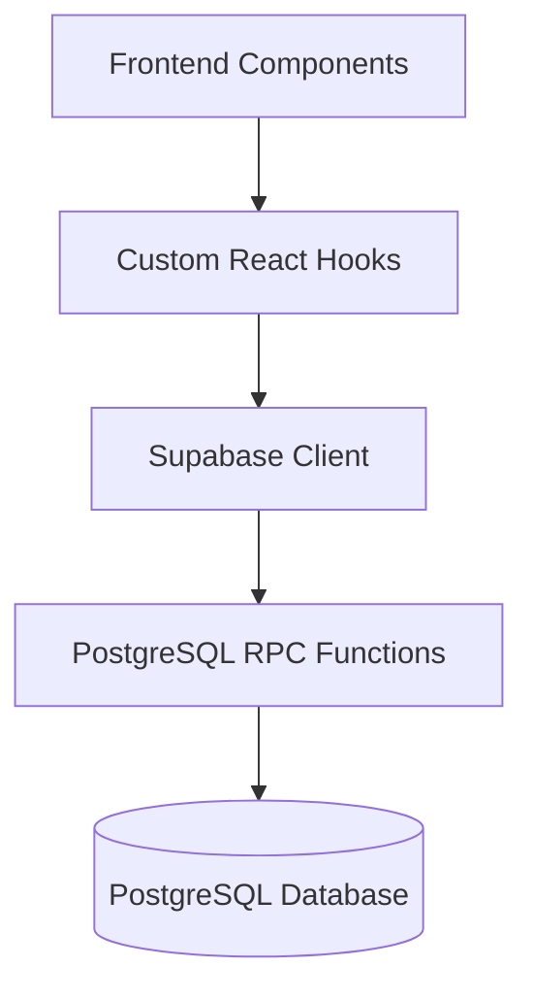

# 🌌 ExecutionOS


> **Transform Your Productivity into Evolution.** 🚀

ExecutionOS is a premium Micro-SaaS platform designed for high-performers who want to gamify their professional and personal development. It's not just a task manager; it's an intelligent prioritization engine that tracks your mastery across multiple skills and areas of life.

---

## ✨ Features

- **🎯 Intelligent Prioritization**: Custom scoring algorithm that ranks your tasks based on impact, duration, and status.
- **🧬 Hierarchical Evolution System**: 
    - **Areas**: Macro domains (e.g., Career, Health, Studies).
    - **Skills**: Specific disciplines (e.g., Coding, Design, Marketing).
    - **SubSkills**: Granular mastery (e.g., React, SQL, Copywriting).
- **📈 Atomic XP Propagation**: Real-time experience distribution through your entire skill tree, handled directly in the database for maximum reliability.
- **⏱️ Integrated Task Timer**: Precise time tracking with manual controls to ensure every second of focus counts.
- **🕸️ Radar Mastery Chart**: Visual feedback on your skill distribution to identify where you're excelling and where you need focus.
- **✍️ Seamless Task Editing**: Complete control over your planning with subskill weight re-distribution.

## 🛠️ Tech Stack

- **Frontend**: [Next.js 15](https://nextjs.org/) + [React](https://reactjs.org/) + [Tailwind CSS](https://tailwindcss.com/)
- **Backend/DB**: [Supabase](https://supabase.com/) (PostgreSQL + Auth + Realtime)
- **Icons**: [Lucide React](https://lucide.dev/)
- **Charts**: [SVG-based Custom Radar Charts]

---

## 🚀 Getting Started

### 1. Prerequisites
- Node.js (v18+)
- Supabase Account

### 2. Installation
```bash
git clone https://github.com/PmwMaster/ExecutionOS.git
cd ExecutionOS
npm install
```

### 3. Environment Setup
Create a `.env.local` file in the root:
```env
NEXT_PUBLIC_SUPABASE_URL=your_supabase_url
NEXT_PUBLIC_SUPABASE_ANON_KEY=your_supabase_anon_key
```

### 4. Database Setup
Run the migrations found in `supabase/migrations/` in your Supabase SQL Editor:
1. `01_initial_schema.sql`
2. `02_evolution_system.sql`

### 5. Run Locally
```bash
npm run dev
```

---

## 🏗️ Architecture

ExecutionOS follows a clean, hook-based architecture for state management and direct database communication through a secure RPC (Remote Procedure Call) layer.



---

## 📄 License
This project is for personal evolution and demonstration. [MIT License](LICENSE)

---
*Developed with focus and precision.* 🥊⚡
